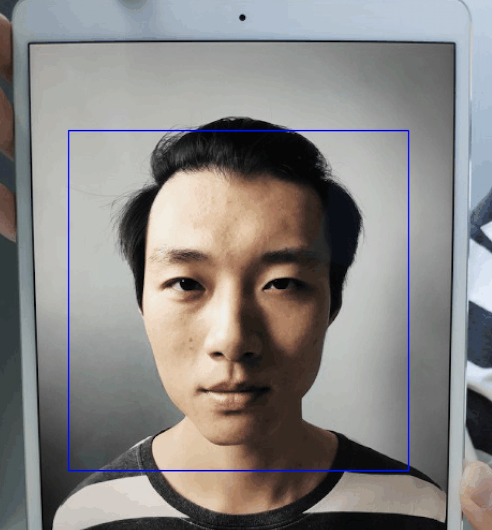

## HyperFAS 基于深度学习人脸静默活体算法

人脸活体验证是人脸识别过程中重要的一环，主要用以区分真实人脸与假脸图像，能够识别利用纸张打印、屏幕翻拍、3D模型等方式的欺骗行为。我们在算法设计阶段，尝试了不同的方法，包括：SVM、LBP、深度学习等。针对单一场景或者摄像头，能够得到不错的效果，但是没有得到一个能够适配多种摄像头的活体算法，这里我们将其中一个较好模型开放出来，但是在逆光等情况下效果依然不是很好，大家可以作为参考。

这个模型大约采用了36w张图像，其中假脸18w张，真脸18w万张，包括纸张、屏幕，也采用了大部分公开的假脸数据集。

### 依赖

+ 基于mobilenet-0.5

+ OpenCV 3.4.3+

+ MTCNN人脸检测

+ Keras，TF

+ Python3

### 运行

+ python src/demo.py

### 测试样例

### 相关数据集

+ [NUAA](http://parnec.nuaa.edu.cn/xtan/data/nuaaimposterdb.html)

+ [IDIAP：The Replay-Attack Database](https://www.idiap.ch/dataset/replayattack)

+ CASIA FASD

+ [The Oulu-NPU face anti-spoofing database](https://sites.google.com/site/oulunpudatabase/)

+ [Spoof in the Wild (SiW) Face Anti-spoofing Database](http://cvlab.cse.msu.edu/spoof-in-the-wild-siw-face-anti-spoofing-database.html)
